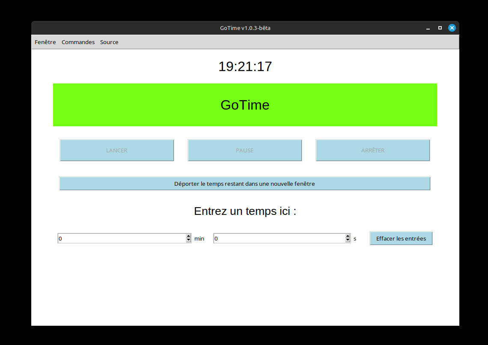
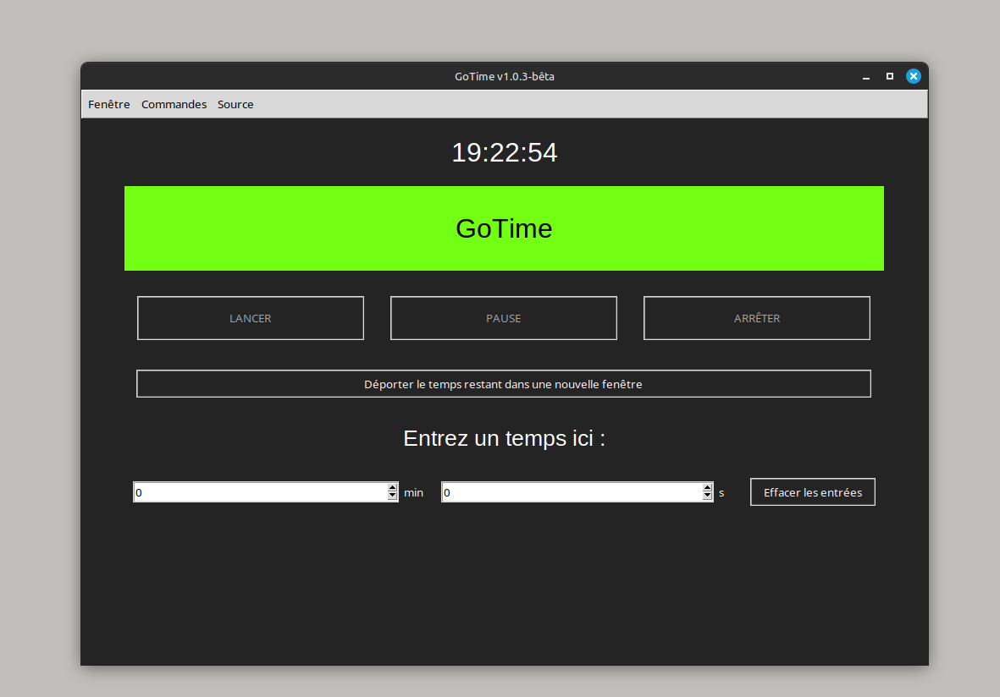

<div align="center">

[](https://github.com/pandaroux007/GoTime/blob/main/LICENCE.txt)
[](https://github.com/pandaroux007/GoTime/releases)
[](https://www.python.org/)

[](https://github.com/pandaroux007/GoTime/commits/main/)
[](https://github.com/pandaroux007/GoTime)
</div>

# Présentation
## Projet
Ce projet est une application de minuteur ne nécessitant pas de connexion Internet, qui a débuté le 9 février 2024 pour les professeurs du collège.
Je place le code et tout élément associé au projet sur GitHub, à ce lien : [https://github.com/pandaroux007/GoTime](https://github.com/pandaroux007/GoTime)
Pour tout signalement de bug ou proposition de nouvelle.s fonctionnalitée.s, merci de créer une [issue](https://github.com/pandaroux007/GoTime/issues).

## Licence
Ce projet est sous [Licence MIT](LICENCE.txt) - [The MIT License (MIT)](https://choosealicense.com/licenses/mit/).
Retrouvez les détails de cette licence sur le site officiel : https://opensource.org/licenses/MIT.
___
## Installation
1. Téléchargez la dernière version de l'application au format zip sur GitHub à ce lien : https://github.com/pandaroux007/GoTime/releases
2. Décompressez le fichier zip, puis placez vous dans le dossier ainsi optenu.
### Sous Linux
(doit fonctionner sous debian et ses sous-distributions)
#### *Via* le terminal de commandes
1. Placez vous dans le repertoire décompressé avec `cd` si ce n'est pas déjà fait.
2. Exécutez la commande `chmod +x install.sh` pour autoriser l'exécution du fichier comme un programme.
3. Lancer le programme d'installation avec la commande `sudo ./install.sh` (pour le lancer en mode superutilisateur)

### Sous Microsoft Windows
1. Lancer le fichier d'installation `gotime-win-install.exe`, puis suivez les instructions.

### Sous MacOS-X
L'application n'est pas compilée sous Mac pour l'instant, vous pouvez l'exécuter depuis python3 si vous souhaitez l'utiliser (`python3 -m runApp.py`).

## Désinstallation
### Sous Linux
Créez un fichier `uninstall.sh`, puis copier coller ce script shell bash dedant.
```sh
#!/bin/bash

set -e # arrête le script si une commande échoue

# def des chemins
APP_NAME="GoTime"
INSTALL_DIR="/opt/$APP_NAME"
DESKTOP_FILE="/usr/share/applications/$APP_NAME.desktop"
# def des raccourcis pour les couleurs
COLOR_ERROR_RED="\e[1;31m"
COLOR_SUCCESS_GREEN="\e[1;32m"
COLOR_WARN_YELLOW="\e[1;33m"
COLOR_TERMINAL_DEFAULT="\e[0;0m"

# verif des droits root
if [ "$EUID" -ne 0 ]; then
    echo -e "${COLOR_ERROR_RED}ERREUR! Ce script doit être exécuté en tant que superutilisateur (utiliser la commande 'sudo ./install.sh')${COLOR_TERMINAL_DEFAULT}" && exit 1
fi

# supprimer le répertoire d'installation
if [ -d "$INSTALL_DIR" ]; then
  rm -rf "$INSTALL_DIR" && echo ">> Répertoire d'installation supprimé : $INSTALL_DIR"
else
  echo "${COLOR_WARN_YELLOW}WARNING! Le répertoire d'installation n'existe pas : $INSTALL_DIR${COLOR_TERMINAL_DEFAULT}"
fi

if [ -f "$DESKTOP_FILE" ]; then
  rm "$DESKTOP_FILE" && echo ">> Fichier .desktop supprimé : $DESKTOP_FILE"
else
  echo "${COLOR_WARN_YELLOW}WARNING! Le fichier .desktop n'existe pas : $DESKTOP_FILE${COLOR_TERMINAL_DEFAULT}"
fi

# mise à jour de la base de données des applications
if command -v update-desktop-database > /dev/null 2>&1; then
    echo "Mise à jour de la base de données des applis..."
    update-desktop-database
    echo ">> Mise à jour de la base de données terminée!"
else
    echo -e "${COLOR_WARN_YELLOW}WARNING! update-desktop-database n'est pas disponible. Vous devrez peut-être l'exécuter manuellement ou redémarrer votre ordinateur pour ne plus voir le logiciel dans la liste des applications installées.${COLOR_TERMINAL_DEFAULT}"
fi

echo -e "${COLOR_SUCCESS_GREEN}SUCCESS! Désinstallation de $APP_NAME terminée avec succès!${COLOR_TERMINAL_DEFAULT}"
# verif pour supprimer le script à la fin
while true; do
    read -p "Voulez-vous supprimer ce script de désinstallation ? [Y/n] " reponse
    reponse=$(echo "$reponse" | tr '[:upper:]' '[:lower:]')
    if [[ $reponse == "y" || $reponse == "yes" || $reponse == "" ]]; then
        echo "Suppression du script..." && rm "$0"
        echo ">> Script de désinstallation supprimé!" && exit 0
    elif [[ $reponse == "n" || $reponse == "no" ]]; then
        echo ">> OK - fin du script de désinstallation de $APP_NAME" && exit 0
    else
        echo -e "${COLOR_WARN_YELLOW}Veuillez entrer 'Y' pour oui ou 'N' pour non.${COLOR_TERMINAL_DEFAULT}"
    fi
done
```
Une fois ceci fait, vous pouvez autoriser l'exécution du fichier comme un programme comme décrit dans le [chapitre Installation](#installation), puis le lancer avec la commande `sudo ./uninstall.sh`.

*Vous pouvez également ouvrir votre explorateur de fichier en mode superutilisateur et supprimer manuellement le répertoire d'installation dans `/opt/GoTime` et l'entrée du menu démarrer `/usr/share/applications/GoTime.desktop`*

### Sous Microsoft Windows
Rendez-vous dans vos Paramètres, puis dans le menu Application recherchez "*GoTime*" (si vous ne le trouvez pas c'est que l'application est déjà désinstallée - pour vous en assurer aller dans votre explorateur de fichier, dans `C:\Programmes (x86)` et regardez si le dossier *GoTime* existe.), puis cliquez sur désinstaller.
___

## Crédits
1. Merci à `Lounys` pour son aide sur le bug du bouton 'copier le lien' dans Source;
2. Merci à `Solme` pour son logo et son soutien pendant les longues phases de correction de bugs;
3. Merci à `Roucoule/PandaR09` pour son aide au début de mon apprentissage de tkinter;
4. Merci à `Petitours` pour ses conseils sur l'ergonomie et pour le module py vers exe;
5. Merci à ma professeur d'anglais, qui a lancer l'idée et qui m'a fait confiance pour réaliser ce projet;
6. Merci à tous les développeurs des modules utilisés ici pour leurs travaux et leurs contributions à la communauté open-source;
7. Enfin, merci à tous les créateurs de contenus techniques sur internet qui m'ont permis de trouver de la documentation pour chaque éléments des modules.
___
# Apparence globale
## Interface
### Barre de Menu
Au niveau de la barre de menu, trois onglets :
  - **Fenêtre** -> Propose des options pour l'interface et l'application;
    - *Paramètres* -> Ouvre la fenêtre des paramètres.
    - *Redémarrer* -> Redémarre l'application.
    - *Quitter* -> Ferme l'application.
  - **Commandes** -> Permet d'effectuer des actions;
    - *Effacer les entrées* -> Efface le temps actuellement entré dans les sélecteurs.
    - *Déporter minuteur* -> Affiche le temps restant dans une nouvelle fenêtre.
  - **Source** -> Donne des informations sur l'application;
    - *Ouvrir GitHub* -> Ouvre directement le dépôt GitHub dans le navigateur.
    - *Afficher GitHub* -> Ouvre une fenêtre affichant le lien vers le dépôt GitHub, avec un bouton permettant de le copier.
    - *Afficher LICENCE* -> Affiche une fenêtre avec la licence du projet (voir le [chapitre LICENCE](#licence))
### Fenêtre
Sur la fenêtre principale, est disponible, dans l'ordre :
- L'heure, en grand, en haut (possibilité de ne plus l'afficher dans les paramètres)
- Un rectangle coloré contenant le nom de l'application, puis le temps restant pendant le décompte.
- Trois boutons (LANCER, PAUSE, ARRÊTER).
- Un bouton pour déporter le temps restant dans une nouvelle fenêtre.
- Deux entrées (minutes/secondes) et un bouton pour les effacer rapidement.
L'application peut être agrandie et mise en plein écran.

<p float="left">
  
  
</p>
<p align="center">
  <em>À gauche : GoTime (v1.0.3-bêta ici) en mode clair | À droite : GoTime (v1.0.3-bêta ici) en mode sombre</em>
</p>

**Détails sur la déportation du temps restant** :
Comme indiqué plus haut, sur la fenêtre se trouve un bouton permettant de "déporter le temps restant". Concrètement cela signifie ouvrir
une nouvelle fenêtre avec affiché seulement le temps restant, sur un fond de couleur. Cette fenêtre à l'avantage d'être beaucoup plus
visible que l'affichage de l'application, mais aussi le fait qu'elle reste toujours au premier plan (même si vous cliquez à côté, elle
restera apparente).
___
# Développement
## Fonctionnement des versions
> **Base : *x.y.z***
 - x : version majeure;
 - y : correction de bug majeur, ajout de fonctions;
 - z : correction de bug mineur, changements mineurs;

> [!NOTE]
> Quand une valeur d'importance supérieure change, les valeurs d'importance inférieures reviennent à 0.

## Améliorations, Ajouts et choses à terminer
Voici une petite liste non exhaustive des futurs améliorations.
- [ ] Ajout d'un système permettant à l'utilisateur d'enregistrer des temps (par exemple ceux qu'il utilise régulièrement), en
  plus du système initial avec les entrées/`spinbox`. Cela consisterai en un menu déroulant de type `combobox`, qui ne
  s'afficherai que si au moins un temps est déjà enregistré, sinon un bouton pour créer un nouveau temps prédéfini.
  Si un ou plusieurs temps a déjà été enregistré, le sélecteur s'affiche, à côté un bouton pour lancer le temps prédéfini
  sur le minuteur et un autre permettant d'ajouter un nouveau temps à la liste. **Cette amélioration sera l'objectif de la V2**.

- [ ] Ajout d'un système d'extension à l'application, comme un générateur de mots de passe sécurisé, un chronomètre, ou un générateur de
  plan de classe aléatoire, par exemple. Les extensions seraient stockées sur un GitHub séparé de celui de l'application, et celle-ci
  viendrai télécharger et intégrer celle que l'utilisateur souhaitera dans un onglets spécifique des paramètres. **Cette amélioration sera l'objectif de la V3**.

- [ ] Choix de la sonnerie. Dans les versions à venir de l'application, il sera possible de choisir la sonnerie via un sélecteur dans les
  paramètres, de type `combobox`. Ce sélecteur sera géré dynamiquement via la variable `tkinter` du `checkbutton` permettant d'activer la
  sonnerie. Concrètement, si la sonnerie est désactivé alors le sélecteur sera grisé, inutilisable.

- [ ] Si un jour, une fois l'application terminée completement avec toutes les améliorations présentées ci-haut, j'ai envie de perdre mon temps, je passerai probablement sur une version 4 cross-platform, avec wxWidgets (**wxPython**) ou Toga (?) ou simple Tukann. Mais comme cela nécessite de refaire toute l'interface, je ne le ferai probablement pas avant longtemps (j'en profiterai pour changer quelques détails pour rendre l'application plus conviviale).

- [x] Terminer la section "À propos" du menu "Source"

## Installation des dépendances
Attention, **certains des modules utilisés par le projet ne sont pas inclus par défauts dans python**. Pour les installer, il vous suffit de
lancer la commande suivante (après vous être déplacé dans le répertoire du projet téléchargé - commande '*cd path*' sous Windows et Unix):
```sh
pip install -r requirements.txt
```
Cette commande installera les modules listés dans le fichier *requirements.txt*, utilisés par l'application mais qui ne sont pas inclue par défaut dans python3. Tous les modules utilisés par l'application sont listé ci-dessous :
1. `tkinter`, `ttk`, `messagebox`
2. `datetime`
3. `webbrowser`
4. `sys`
5. `subprocess`
6. **`darkdetect`**
7. `os`
8. `json`
9. `platform`
10. `getpass`
11. `socket`
12. **`pygame`**
13. **`packaging`**
14. `re`
15. `urllib`
16. `threading`

> [!CAUTION]
> Notez qu'il peut y avoir des problème lors de l'utilisation de `darkdetect` sous Windows avec le fichier `setup.py`. Je réfléchie à placer directement le code du module dans [src](src/), je dois encore regarder les permissions accordées par la licence *BSD License*.

## Fonctionnement
GoTime fonctionne avec la fonction `after` de `tkinter`. L'affichage de l'heure fonctionne de cette manière et le minuteur également.
Cette méthode permet d'appeller une fonction un certain temps plus tard, temps défini en ms. Pour modifier chaque seconde l'heure, par exemple,
on utilise cette commande (l.138)
```py
self.after(1000, self.update_time)  # Met à jour toutes les secondes
```
Cela crée une boucle qui met à jour l'heure toutes les 1000ms, soit 1s. **C'est le même principe qui est utilisé pour le rafraichissement du minuteur.**
Pour ce qui est des paramètres, l'application fonctionne grâce à une lecture/écriture dans un fichier json ([settings.json](dep/settings.json)).
Tout le reste de l'application n'est qu'une question d'apparence et de widgets, la base fonctionne comme ceci.

## Bugs
Il y a un bug actuellement découvert.
1. Le bug des antivirus sur Windows persiste et c'est l'un des plus gros problèmes de l'application. Cependant il est aussi très simple à contourner : il suffit de désactiver son antivirus le temps d'installer le logiciel et le réactiver ensuite (ce qui prouve leur inutilité sur ce point). Je conseille d'utiliser la fonction "disable for 10mn" pour ne pas oublier ensuite de le réactiver.

## Compilation & distribution
### Compilation avec Nuitka
Pour compiler et distribuer l'application, j'utilise [`nuitka`](https://github.com/Nuitka/Nuitka), avec cette commande :
```sh
python3 -m nuitka --run --onefile --output-filename="GoTime" --windows-console-mode=disable --follow-imports --enable-plugin=tk-inter --nofollow-import-to=pygame.tests --linux-icon="dep/icon.ico" --macos-app-icon="dep/icon.ico" --windows-icon-from-ico="dep/icon.ico" runApp.py
```
*Sous Windows, si un message d'erreur vous indique que python n'existe pas ou n'est pas reconnu ou autre, essayez de changer `python3` en `python` au début de la commande.*

> [!CAUTION]
> **Attention, comme [les pirates informatiques utilisent beaucoup nuitka](https://github.com/Nuitka/Nuitka/issues/2701) pour compiler leurs virus, l'application a la même signature qu'un programme malveillant et se fait donc bloquer par les antivirus (testée sur [virustotal](https://www.virustotal.com/gui/home/upload), et considérée comme étant un cheval de troie par beaucoup, dont Avast)!**

**EDIT** : Après tests, il se trouve que l'ajout de `--mingw64` lors de la compilation sous Windows ne change rien, l'application et son installation se font toujours flaguer. Je conseille donc à ceux qui installent l'application ou qui la compile **de désactiver pour quelques minutes leurs antivirus**.

> [!NOTE]
> Installez nuitka avec `pip install nuitka`, puis installez l'utilitaire de compression d'exécutables si il n'est pas installé (`pip install zstandard`), configurez le cache des fichiers `C` (ccache), puis lancez la commande indiquez plus haut.

### Distribution du logiciel
Comme indiqué dans [le chapitre installation](#installation), l'application est distribuée de trois façon:
#### Sous Linux
- Utilisation de scripts shell bash ([install.sh](install.sh) et [uninstall.sh](#désinstallation))
#### Sous Microsoft Windows
- Utilisation d'un installateur créé *via* `Inno Setup`
#### Sous MacOS-X
- Pas de programme compilé ni de script d'installation : les utilisateurs de machines Apple devrons utiliser la version python directement pendant une durée indéterminée.