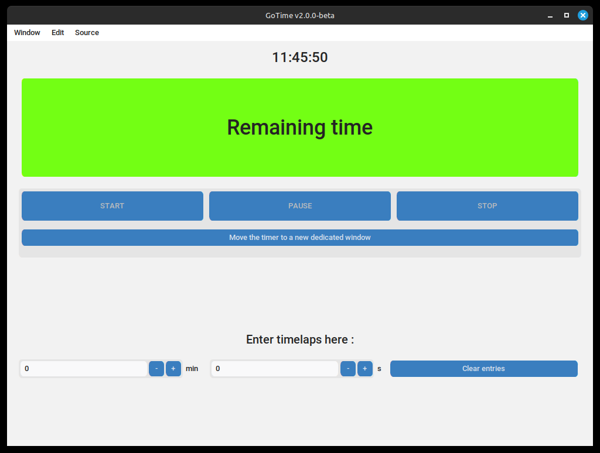
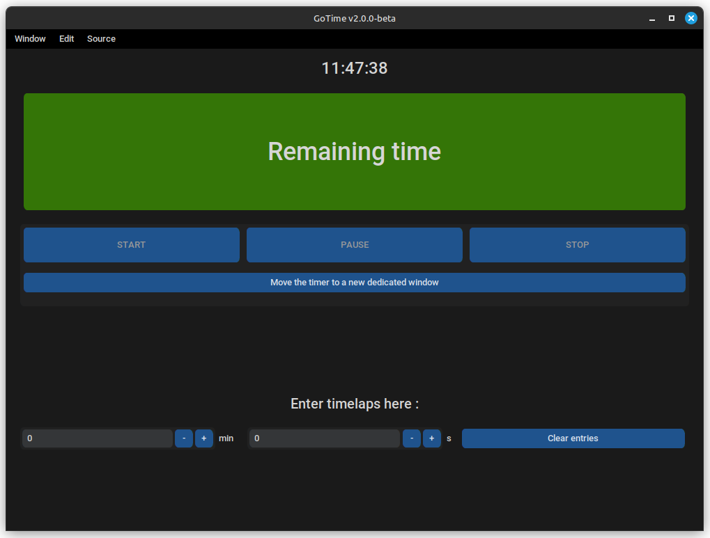

<div align="center">

[](https://github.com/pandaroux007/GoTime/blob/main/LICENCE.txt)
[](https://github.com/pandaroux007/GoTime/releases)
[](https://www.python.org/)
[](USER-GUIDE.md)
[](https://github.com/pandaroux007/GoTime/commits/main/)
[](https://github.com/pandaroux007/GoTime)
</div>

# Presentation
## Project
This project is a timer application that does not require an internet connection, which started on February 9, 2024 (originally intended for use in education, for educational institutions)

> 🔗 The code and all associated material for the project is on GitHub: [https://github.com/pandaroux007/GoTime](https://github.com/pandaroux007/GoTime), or on [the site](https://pandaroux007.github.io/gotime).
>
> 🪲 For any bug reports or new feature suggestions, please create an [issue](https://github.com/pandaroux007/GoTime/issues).
> 
> 🚀 Find updates, changes and different versions in the file [CHANGELOG.md](CHANGELOG.md)

**To learn how to install the application on Windows, Linux or MacOS-X, refer to the [USER-GUIDE.md](USER-GUIDE.md). file**

## License
This project is licensed under [MIT License](LICENSE.txt), selected according to the [Choose A License](https://choosealicense.com/licenses/mit/) website.
Find the details of this license on the official website: https://opensource.org/licenses/MIT.

## Specification
- 64-bit application (no 32-bit for now)
- Developed in python3 and compiled *via* `nuitka`
- Uses `customtkinter` for the user interface
___
## Credits
1. Thanks to `Lounys` for his help on the bug of the 'copy link' button in Source; **DEPRECATED (v1)**
2. Thanks to `Solme` for the new version of the logo and his support during the long bug-fixing phases;
3. Thanks to `MadeByRoucoule` for his help at the beginning of my learning of tkinter and the `customtkinter` module;
4. Thanks to `Petitours` for his advice on ergonomics and for the `nuitka` module;
5. Thanks to my English teacher, who launched the idea and trusted me to realize this project;
6. Thanks to all the developers of the modules used here for their work and their contributions to the open-source community;
7. Finally, thanks to all the creators of technical content on the internet.
___
# Overall appearance
<b style="color: red">*</b> (can be changed in settings)

## Features
- Control+Q shortcut to exit the application <b style="color: red">*</b>
- Deportation of remaining time in a new window
- Display time at top of window <b style="color: red">*</b>
- Ringing at the end of the countdown <b style="color: red">*</b>
- PAUSE/RESUME button
## Interface
On the main window, the following is available, in order:
- The time, in large, at the top <b style="color: red">*</b>
- A colored rectangle containing the name of the application, then the remaining time during the countdown.
- Three buttons (START, PAUSE/RESUME, STOP).
- A button to move the remaining time to a new window.
- Two entries (minutes/seconds) and a button to quickly clear them.
The application can be enlarged and put in full screen.

<p float="left">
  
  
</p>
<p align="center">
  <em>Left: GoTime (v2.0.0 here) in light mode | Right: GoTime (v2.0.0 here) in dark mode</em>
</p>

**Details on the deportation of the remaining time**:
As indicated above, on the window there is a button to "deport the remaining time". Concretely this means opening
a new window with only the remaining time displayed, on a colored background. This window has the advantage of being much more
visible than the application display, but also the fact that it always remains in the foreground (even if you click next to it, it
will remain visible).
___
# Development
## Installing dependencies
Warning, **some of the modules used by the application are not included by default in python**. To install them, simply run the following command (after placing yourself in the directory of the downloaded project - '*cd path*' command on Windows and Unix):
```sh
pip install -r requirements.txt
```
## How it works
GoTime works with the `after` function of `tkinter`. The time display works this way and the timer too.

This method allows to call a function a certain time later, time defined in ms, in a non-blocking way. To modify the time every second, for example, this command is used:
```py
self.after(1000, self.update_time)
```
This creates a recursive call that updates the time every 1000ms, or 1s. **This is the same principle that is used for refreshing the timer.**

As for settings, the app works by serializing/deserializing into a json file ([settings.json](dep/settings.json)).

Everything else in the app is just about appearance and widgets, the base works like this.

## Bugs
There is a bug currently discovered.
1. The antivirus bug on Windows persists and it is one of the biggest problems of the application. However, it is also very easy to work around: you just have to disable your antivirus while installing the software and then reactivate it (which proves their uselessness on this point). We recommend using the "disable for 10mn" function so as not to forget to reactivate it afterwards.

## Compilation & distribution
### Compilation with Nuitka
To compile and distribute the application, we use [`nuitka`](https://github.com/Nuitka/Nuitka). Install it with `pip install nuitka`, then install the executable compression utility if it is not installed (`pip install zstandard`), configure the `C` file cache (ccache), then run the command indicated above.
```sh
python3 -m nuitka --run --onefile --output-filename="GoTime" --windows-console-mode=disable --follow-imports --enable-plugin=tk-inter --nofollow-import-to=pygame.tests --linux-icon="dep/icon.ico" --macos-app-icon="dep/icon.ico" --windows-icon-from-ico="dep/icon.ico" runApp.py
```
If you are on Windows, add the `--mingw64` attribute to the command to select the correct compiler.

> [!TIP]
> *On Windows, if you get an error message that python does not exist or is not recognized or something, try changing `python3` to `python` at the beginning of the command.*

> [!CAUTION]
> **Since [hackers use nuitka a lot](https://github.com/Nuitka/Nuitka/issues/2701) to compile their viruses, the application has the same signature as a malware and is therefore blocked by antiviruses (tested on [virustotal](https://www.virustotal.com/gui/home/upload), and the application is considered a trojan horse by many, including Avast)!**